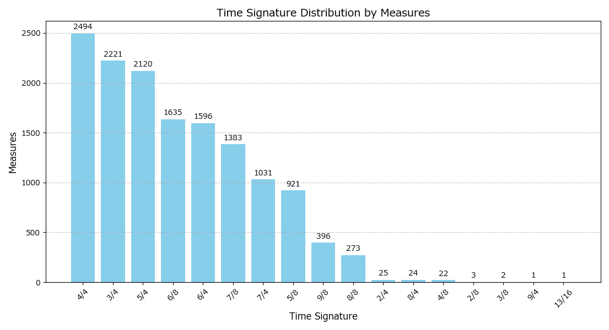
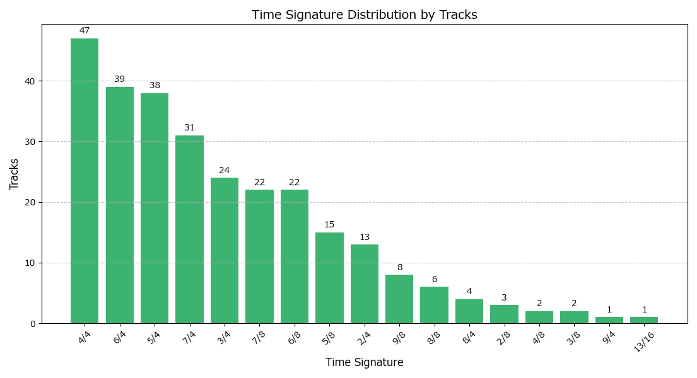
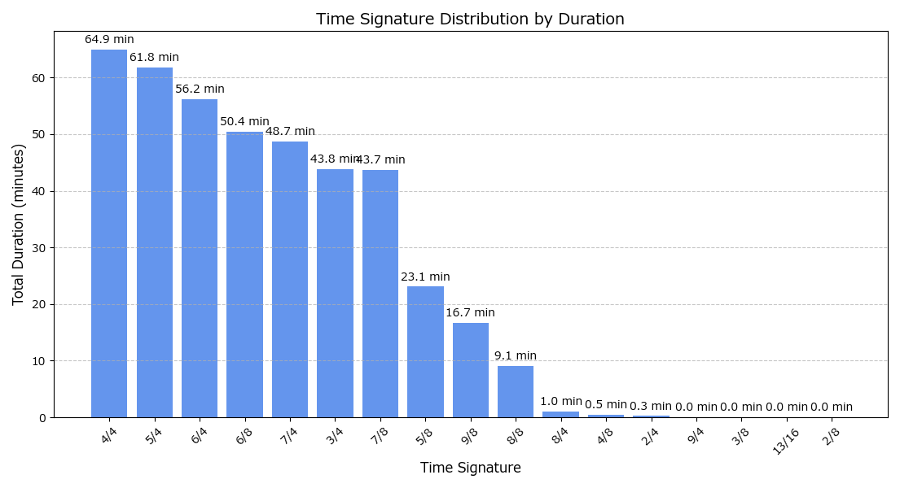

# uncommon-meter-beat-dataset

[English](README.md) | 日本語

この `uncommon-meter-beat-dataset` リポジトリは、変拍子や拍子変化を多く含む楽曲に焦点を当てた annotation-only の beat/downbeat データセットです。公開されている beat-tracking 用データセットは 4/4 に偏りがちで、一般的でない拍子に対する学習や評価が難しいことがあります。このリポジトリは、その不足を補うために、珍しい拍子や拍子変化を含む楽曲の注釈をまとめたものです。

音源は意図的に配布していません。公開しているのは注釈ファイルとメタデータのみです。各トラックの安定した識別子として `youtube_id` を使い、対応表は [`metadata.csv`](metadata.csv) にまとめています。

## 現在の概要

このブロックは [`parsed_beats/`](parsed_beats) から `python update_dataset_docs.py` で自動更新されます。

<!-- DATASET_STATS:START -->
- 114 曲
- 14,148 小節
- 注釈対象の合計長さは約 420.4 分
- 17 種類の拍子
- 81 曲に拍子変化あり
- 95 曲が奇数拍子を含む
- 全小節のうち 4/4 は約 17.6%
- `{2/4, 3/4, 4/4, 6/8}` 以外の拍子が全小節の約 54.9%
<!-- DATASET_STATS:END -->

## このデータセットの目的

日常的な音楽全体をバランスよく代表することが目的ではありません。狙っているのは、既存モデルが苦手になりやすいケースを補うことです。多くの公開データセットでは変拍子や拍子変化が少ないため、beat-tracking モデルがそうしたケースでうまく一般化できないことがあります。このコレクションは、そのギャップを埋めるために意図的に偏らせています。

## リポジトリ構成

```text
beats/                  元の .beat 注釈ファイル
parsed_beats/           解析しやすいように正規化した JSON 注釈
output_graphs/          データセット統計の図
export_metadata_csv.py  注釈ファイルから metadata.csv を生成
update_dataset_docs.py  README と dataset card の集計値を更新
metadata.csv            youtube_id を主キーにしたトラック単位メタデータ
```

## 注釈フォーマット

各 parsed JSON ファイルには以下が含まれます。

- `youtube_id`: トラック識別子
- `measures`: 小節単位の注釈リスト

各小節エントリには以下が含まれます。

- `measure_index`
- `downbeat_sec`
- `time_sig_num`
- `time_sig_den`
- `tempo_bpm`
- `base_note`
- `annotations`

そのため、このリポジトリは audio 付きデータセットというより、downbeat と time signature の annotation-only データセットとして扱うのが適切です。音源取得と権利確認は利用者側で行う想定です。

## メタデータ

[`metadata.csv`](metadata.csv) は [`parsed_beats/`](parsed_beats) から生成され、次の情報を含みます。

- `youtube_id` と `youtube_url`
- 元ファイル名から推定した曲名
- 元の `.beat` ファイル名と対応する parsed JSON ファイル名
- 小節数と推定再生時間
- 各トラックに含まれる拍子の一覧
- 拍子変化、奇数拍子、一般的でない拍子の有無
- 注釈数と注釈ラベル一覧

再生成コマンド:

```bash
python export_metadata_csv.py
```

## 統計

[`output_graphs/`](output_graphs) に、現在のデータセット統計をまとめた図があります。





## 派生ファイルの再生成

```bash
python parse_beats.py
python analyze_beat_data.py
python export_metadata_csv.py
python update_dataset_docs.py
```

`analyze_beat_data.py` には `matplotlib` が必要です。メタデータ出力スクリプトとドキュメント更新スクリプトは標準ライブラリのみで動きます。

## 制約

- このコレクションは変拍子や拍子変化に意図的に偏っており、一般的な音楽分布を代表しません。
- 音源は含みません。
- トラック長は連続する downbeat から推定しており、最後の小節だけはローカルなテンポと拍子から近似しています。
- ファイル名には可読性のため曲名が残っていますが、正規のキーとしては `youtube_id` を使うべきです。

## 公開前の注意

このリポジトリは [MIT License](LICENSE) で公開します。音源は含みません。
